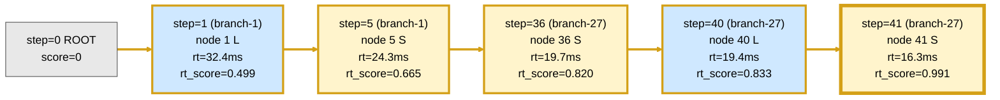
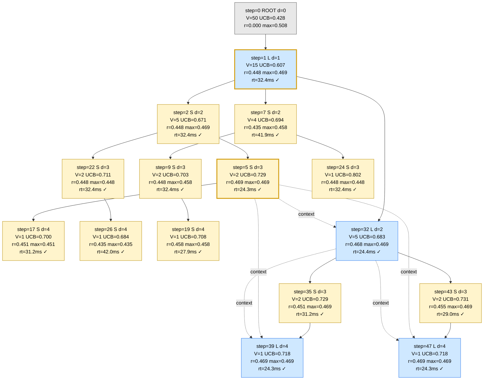
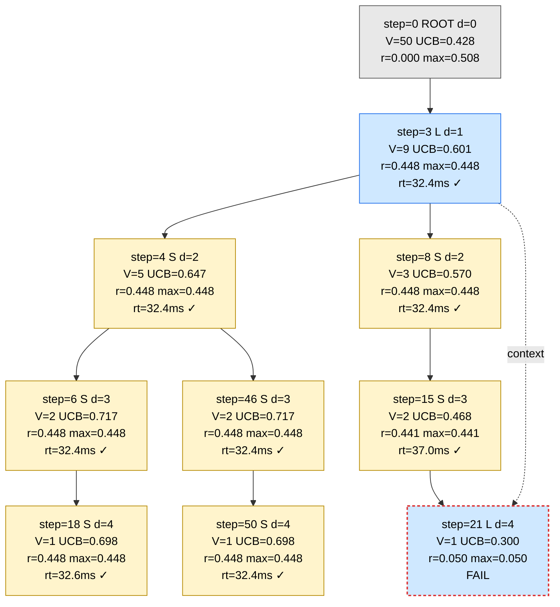
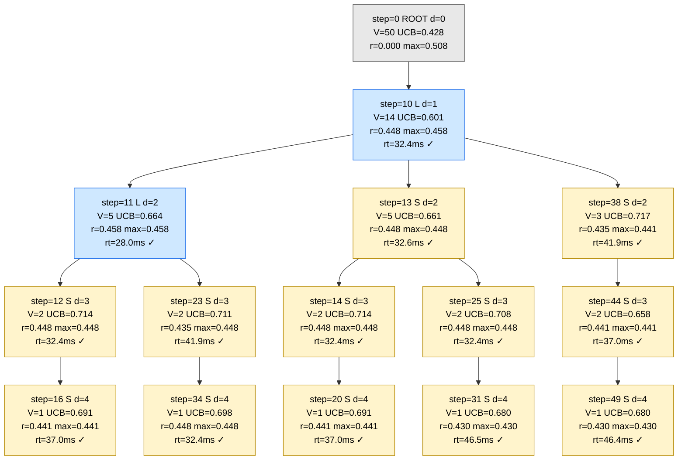
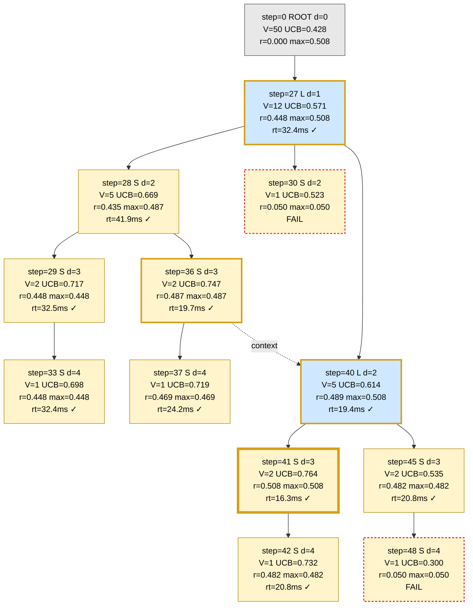
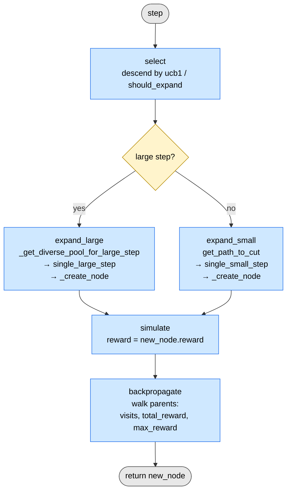

# MCTS Debug Output — KB-l2 Problem 2 (50 steps)

Run: `outputs/KB-l2_AdaExplore_50/2_2/`
Model: `claude-opus-4-7` · `total_steps=50` · `exploration_weight=0.3` · `reward_alpha=0.0` (UCB uses avg_reward only) · `p_large=0.2`

Tree summary (`tree_stats.json`): 51 nodes, max depth 4, avg depth 2.90, total visits 198, large-step nodes 10, small-step nodes 40.
Global best: **node 41**, score `[1, 1, 0.991]`, runtime 16.3ms (baseline 16.15ms).

Hardware note: this run executed on `NVIDIA GeForce RTX 4090` (per `global_best_metrics_50.json`), not the A6000 @ 1500MHz fp32 used for Table 1 in the paper — fast_p values here are not directly comparable to the paper.

## Visual conventions

- **Fill**: blue = large_step, yellow = small_step, grey = dummy_root
- **Border**: thick gold = on the best-so-far trail; gold-ringed thicker = global best (step 41); red dashed = correctness=False
- **Edges**: solid `→` = tree parent; dashed `⇢` = `context_node_ids` (large-step regen used these as seed); thick gold `==>` (best-so-far diagram only) = best-so-far progression, NOT a structural relation
- **Label** (4 lines): `step=N L|S|R d=D` · `V=v UCB=u` · `r=node max=subtree` · `rt=Xms ✓|FAIL`
- All `V` and `UCB` are end-of-run values (from `tree_structure.txt`); `r` (node_reward) is fixed at this kernel's own score.
- `rt_score` (used only in the best-so-far diagram) = `baseline_time / runtime` (≈ fast_p / speedup ratio). This is NOT the same as `r` (node_reward) shown elsewhere.

## Best-so-far evolution

Note: edges below are **best-so-far progression** (each node was a new best at that step), NOT tree-parent or context relations. See branch diagrams below for actual structure.

## Branch 1 (root child node 1, 15 nodes)

## Branch 3 (root child node 3, 9 nodes)

## Branch 10 (root child node 10, 13 nodes)

## Branch 27 (root child node 27, 12 nodes — contains global best)

## Observations

1. **Reward plateau ≈ 0.448.** Almost every successful kernel sits at `r ≈ 0.448` — that's the score for a correct kernel running at baseline-ish speed. The score formula barely separates correct kernels by speedup until the runtime drops well below baseline (16.15ms).
2. **The breakthrough is local.** The global best (41) comes from a small_step refinement of node 40. Node 40 is a large_step whose **tree parent** is node 27, but whose **context seed** is node 36 (`context=[36]`) — i.e., AdaExplore launched a fresh large_step regen under branch 27 using the promising small_step finding at node 36 as its seed. The `36 ⇢ 40` context edge is the load-bearing one.
3. **Branch 1 has the most exploration (15 nodes) but couldn't break 24.3ms.** UCB drove revisits because `avg_reward` stayed high (~0.45) while runtime never dipped. Nodes 32/39/47 are large_step regenerations: 32 is seeded by node 5 (`context=[5]`), and 39/47 are both seeded by 5 and 32 (`context=[5, 32]`). They all converge to ~24.3ms but never further.
4. **Failures barely hurt.** Nodes 21, 30, 48 each pull avg_reward to 0.05, but with visits=1 their UCB is too low to ever be picked again — MCTS naturally prunes them.
5. **UCB caveat.** The values shown are end-of-run. The actual selection at step 36 used the UCB at that moment, which would have been different. Recovering historical UCBs would require replaying backprop from the per-step logs.

## Full tree (all branches)

All 51 nodes in one view: solid `→` = tree parent, dashed `⇢` = `context_node_ids` (large-step seeds), gold border = best-so-far trail (1 → 5 → 36 → 40 → 41), thick gold = global best (41), red dashed = correctness=False (21, 30, 48).

```mermaid
flowchart TD
  N0["step=0 ROOT d=0<br/>V=50 UCB=0.428<br/>r=0.000 max=0.508"]:::root

  N1["step=1 L d=1<br/>V=15 UCB=0.607<br/>r=0.448 max=0.469<br/>rt=32.4ms ✓"]:::large
  N2["step=2 S d=2<br/>V=5 UCB=0.671<br/>r=0.448 max=0.469<br/>rt=32.4ms ✓"]:::small
  N5["step=5 S d=3<br/>V=2 UCB=0.729<br/>r=0.469 max=0.469<br/>rt=24.3ms ✓"]:::small
  N17["step=17 S d=4<br/>V=1 UCB=0.700<br/>r=0.451 max=0.451<br/>rt=31.2ms ✓"]:::small
  N22["step=22 S d=3<br/>V=2 UCB=0.711<br/>r=0.448 max=0.448<br/>rt=32.4ms ✓"]:::small
  N26["step=26 S d=4<br/>V=1 UCB=0.684<br/>r=0.435 max=0.435<br/>rt=42.0ms ✓"]:::small
  N7["step=7 S d=2<br/>V=4 UCB=0.694<br/>r=0.435 max=0.458<br/>rt=41.9ms ✓"]:::small
  N9["step=9 S d=3<br/>V=2 UCB=0.703<br/>r=0.448 max=0.458<br/>rt=32.4ms ✓"]:::small
  N19["step=19 S d=4<br/>V=1 UCB=0.708<br/>r=0.458 max=0.458<br/>rt=27.9ms ✓"]:::small
  N24["step=24 S d=3<br/>V=1 UCB=0.802<br/>r=0.448 max=0.448<br/>rt=32.4ms ✓"]:::small
  N32["step=32 L d=2<br/>V=5 UCB=0.683<br/>r=0.468 max=0.469<br/>rt=24.4ms ✓"]:::large
  N35["step=35 S d=3<br/>V=2 UCB=0.729<br/>r=0.451 max=0.469<br/>rt=31.2ms ✓"]:::small
  N39["step=39 L d=4<br/>V=1 UCB=0.718<br/>r=0.469 max=0.469<br/>rt=24.3ms ✓"]:::large
  N43["step=43 S d=3<br/>V=2 UCB=0.731<br/>r=0.455 max=0.469<br/>rt=29.0ms ✓"]:::small
  N47["step=47 L d=4<br/>V=1 UCB=0.718<br/>r=0.469 max=0.469<br/>rt=24.3ms ✓"]:::large

  N3["step=3 L d=1<br/>V=9 UCB=0.601<br/>r=0.448 max=0.448<br/>rt=32.4ms ✓"]:::large
  N4["step=4 S d=2<br/>V=5 UCB=0.647<br/>r=0.448 max=0.448<br/>rt=32.4ms ✓"]:::small
  N6["step=6 S d=3<br/>V=2 UCB=0.717<br/>r=0.448 max=0.448<br/>rt=32.4ms ✓"]:::small
  N18["step=18 S d=4<br/>V=1 UCB=0.698<br/>r=0.448 max=0.448<br/>rt=32.6ms ✓"]:::small
  N46["step=46 S d=3<br/>V=2 UCB=0.717<br/>r=0.448 max=0.448<br/>rt=32.4ms ✓"]:::small
  N50["step=50 S d=4<br/>V=1 UCB=0.698<br/>r=0.448 max=0.448<br/>rt=32.4ms ✓"]:::small
  N8["step=8 S d=2<br/>V=3 UCB=0.570<br/>r=0.448 max=0.448<br/>rt=32.4ms ✓"]:::small
  N15["step=15 S d=3<br/>V=2 UCB=0.468<br/>r=0.441 max=0.441<br/>rt=37.0ms ✓"]:::small
  N21["step=21 L d=4<br/>V=1 UCB=0.300<br/>r=0.050 max=0.050<br/>FAIL"]:::large

  N10["step=10 L d=1<br/>V=14 UCB=0.601<br/>r=0.448 max=0.458<br/>rt=32.4ms ✓"]:::large
  N11["step=11 L d=2<br/>V=5 UCB=0.664<br/>r=0.458 max=0.458<br/>rt=28.0ms ✓"]:::large
  N12["step=12 S d=3<br/>V=2 UCB=0.714<br/>r=0.448 max=0.448<br/>rt=32.4ms ✓"]:::small
  N16["step=16 S d=4<br/>V=1 UCB=0.691<br/>r=0.441 max=0.441<br/>rt=37.0ms ✓"]:::small
  N23["step=23 S d=3<br/>V=2 UCB=0.711<br/>r=0.435 max=0.448<br/>rt=41.9ms ✓"]:::small
  N34["step=34 S d=4<br/>V=1 UCB=0.698<br/>r=0.448 max=0.448<br/>rt=32.4ms ✓"]:::small
  N13["step=13 S d=2<br/>V=5 UCB=0.661<br/>r=0.448 max=0.448<br/>rt=32.6ms ✓"]:::small
  N14["step=14 S d=3<br/>V=2 UCB=0.714<br/>r=0.448 max=0.448<br/>rt=32.4ms ✓"]:::small
  N20["step=20 S d=4<br/>V=1 UCB=0.691<br/>r=0.441 max=0.441<br/>rt=37.0ms ✓"]:::small
  N25["step=25 S d=3<br/>V=2 UCB=0.708<br/>r=0.448 max=0.448<br/>rt=32.4ms ✓"]:::small
  N31["step=31 S d=4<br/>V=1 UCB=0.680<br/>r=0.430 max=0.430<br/>rt=46.5ms ✓"]:::small
  N38["step=38 S d=2<br/>V=3 UCB=0.717<br/>r=0.435 max=0.441<br/>rt=41.9ms ✓"]:::small
  N44["step=44 S d=3<br/>V=2 UCB=0.658<br/>r=0.441 max=0.441<br/>rt=37.0ms ✓"]:::small
  N49["step=49 S d=4<br/>V=1 UCB=0.680<br/>r=0.430 max=0.430<br/>rt=46.4ms ✓"]:::small

  N27["step=27 L d=1<br/>V=12 UCB=0.571<br/>r=0.448 max=0.508<br/>rt=32.4ms ✓"]:::large
  N28["step=28 S d=2<br/>V=5 UCB=0.669<br/>r=0.435 max=0.487<br/>rt=41.9ms ✓"]:::small
  N29["step=29 S d=3<br/>V=2 UCB=0.717<br/>r=0.448 max=0.448<br/>rt=32.5ms ✓"]:::small
  N33["step=33 S d=4<br/>V=1 UCB=0.698<br/>r=0.448 max=0.448<br/>rt=32.4ms ✓"]:::small
  N36["step=36 S d=3<br/>V=2 UCB=0.747<br/>r=0.487 max=0.487<br/>rt=19.7ms ✓"]:::small
  N37["step=37 S d=4<br/>V=1 UCB=0.719<br/>r=0.469 max=0.469<br/>rt=24.2ms ✓"]:::small
  N30["step=30 S d=2<br/>V=1 UCB=0.523<br/>r=0.050 max=0.050<br/>FAIL"]:::small
  N40["step=40 L d=2<br/>V=5 UCB=0.614<br/>r=0.489 max=0.508<br/>rt=19.4ms ✓"]:::large
  N41["step=41 S d=3<br/>V=2 UCB=0.764<br/>r=0.508 max=0.508<br/>rt=16.3ms ✓"]:::small
  N42["step=42 S d=4<br/>V=1 UCB=0.732<br/>r=0.482 max=0.482<br/>rt=20.8ms ✓"]:::small
  N45["step=45 S d=3<br/>V=2 UCB=0.535<br/>r=0.482 max=0.482<br/>rt=20.8ms ✓"]:::small
  N48["step=48 S d=4<br/>V=1 UCB=0.300<br/>r=0.050 max=0.050<br/>FAIL"]:::small

  N0 --> N1
  N1 --> N2
  N2 --> N5
  N5 --> N17
  N2 --> N22
  N22 --> N26
  N1 --> N7
  N7 --> N9
  N9 --> N19
  N7 --> N24
  N1 --> N32
  N32 --> N35
  N35 --> N39
  N32 --> N43
  N43 --> N47

  N0 --> N3
  N3 --> N4
  N4 --> N6
  N6 --> N18
  N4 --> N46
  N46 --> N50
  N3 --> N8
  N8 --> N15
  N15 --> N21

  N0 --> N10
  N10 --> N11
  N11 --> N12
  N12 --> N16
  N11 --> N23
  N23 --> N34
  N10 --> N13
  N13 --> N14
  N14 --> N20
  N13 --> N25
  N25 --> N31
  N10 --> N38
  N38 --> N44
  N44 --> N49

  N0 --> N27
  N27 --> N28
  N28 --> N29
  N29 --> N33
  N28 --> N36
  N36 --> N37
  N27 --> N30
  N27 --> N40
  N40 --> N41
  N41 --> N42
  N40 --> N45
  N45 --> N48

  N5 -. context .-> N32
  N5 -. context .-> N39
  N32 -. context .-> N39
  N5 -. context .-> N47
  N32 -. context .-> N47
  N3 -. context .-> N21
  N36 -. context .-> N40

  class N1,N5,N36,N40 trail
  class N41 best
  class N21,N30,N48 fail

  classDef root  fill:#e8e8e8,stroke:#555,color:#000
  classDef large fill:#cfe8ff,stroke:#1f6feb,color:#000
  classDef small fill:#fff4cc,stroke:#b58900,color:#000
  classDef trail stroke:#d4a017,stroke-width:3px
  classDef best  fill:#fff4cc,stroke:#d4a017,stroke-width:5px,color:#000
  classDef fail  stroke:#d33,stroke-dasharray:4 3,stroke-width:2px
```

## `MCTSKernelOptimizer.step()` — Execution Flow

`step(step_idx)` runs one MCTS iteration in `agent/mcts.py:601`. It follows the textbook four phases (Select → Expand → Simulate → Backpropagate), with project-specific logic in how the expansion type (large vs small step) is chosen and how failed proposals fall back.

### Phases

1. **Selection** (`mcts.py:610`, body at `mcts.py:285`)
   - Start at `self.root` and descend by repeatedly picking `argmax(child.ucb1)`.
   - At each internal node, check `should_expand(...)`: if the "open a new child" UCB exceeds the best existing child's UCB, stop descent and return that node as the expansion point.
   - Otherwise continue until a leaf is reached.

2. **Decide expansion type** (`mcts.py:616`)
   - If the selected node is `dummy_root` → always `large_step`.
   - Else: count children with `created_by == "small_step"`. Force `large_step` when that count `>= small_step_limit`; otherwise pick large with probability `p_large` (default `0.25`), else small.

3. **Expansion** (`mcts.py:627`)
   - `expand_large(selected_node)` — builds a *diverse pool* of best-of-component kernels along the path-to-root (plus optional softmax/geometric-sampled extras from off-path components), calls `single_large_step` to propose a new kernel, attaches it as a child labelled `large_step`.
   - `expand_small(selected_node)` — walks `get_path_to_cut()` (up to the nearest `large_step` ancestor), feeds the last `max_memory_round` kernels as context to `single_small_step`, attaches the refined kernel as a child labelled `small_step`.
   - Each new node is built via `_create_node`, which updates `global_best_node` if its `score` tuple is higher (`mcts.py:279`).

4. **Fallback on failure** (`mcts.py:632`)
   - If the chosen expansion returned `None`, retry with the other expansion type.
   - If that also returns `None`, log a warning and return `selected_node` (no new node added, no simulate/backprop).

5. **Simulation** (`mcts.py:644`, body at `mcts.py:532`)
   - `simulate(new_node, num_rollouts=1)` just returns `new_node.reward` — the reward derived from `(compiled, correct, speedup)` via the `REWARD_*` / `SPEEDUP_*` constants. No real rollouts are performed (multi-rollout path raises `NotImplementedError`).

6. **Backpropagation** (`mcts.py:647`, body at `mcts.py:546`)
   - Walk from `new_node` upward to the root: for each ancestor increment `visits`, add `reward` to `total_reward`, and update `max_reward` if beaten.

7. **Return** `new_node` (or `selected_node` on total expansion failure).

### Mermaid call-flow

