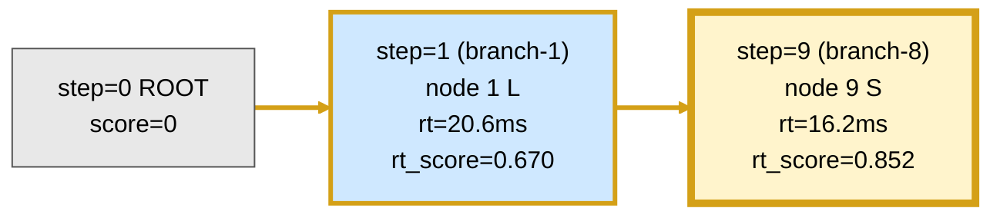
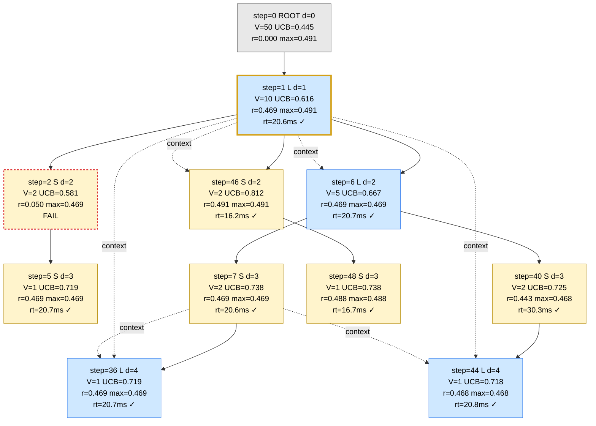
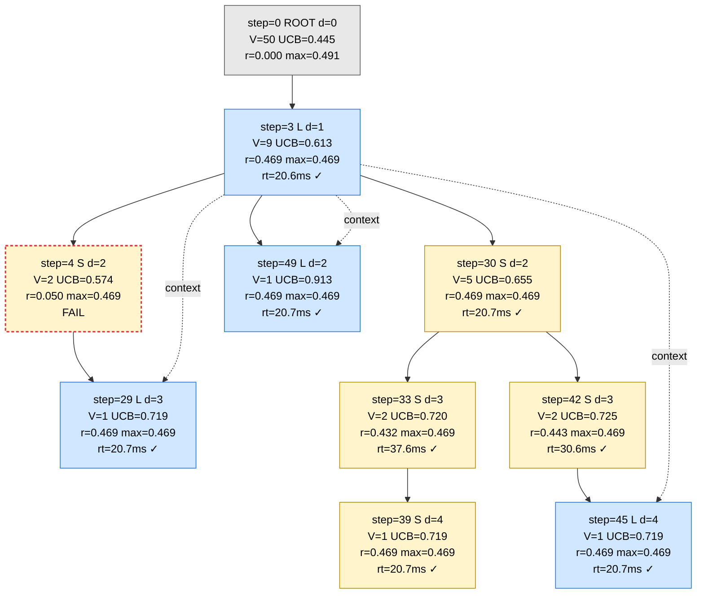
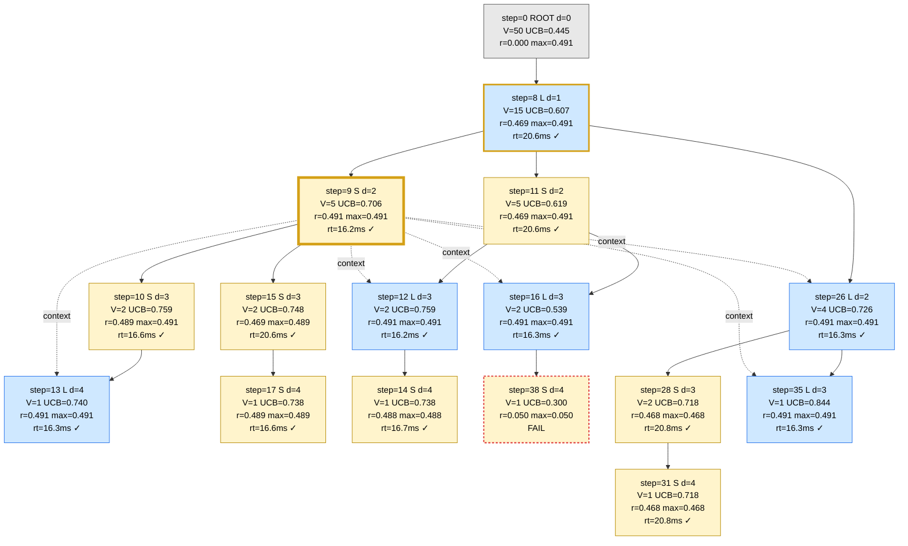
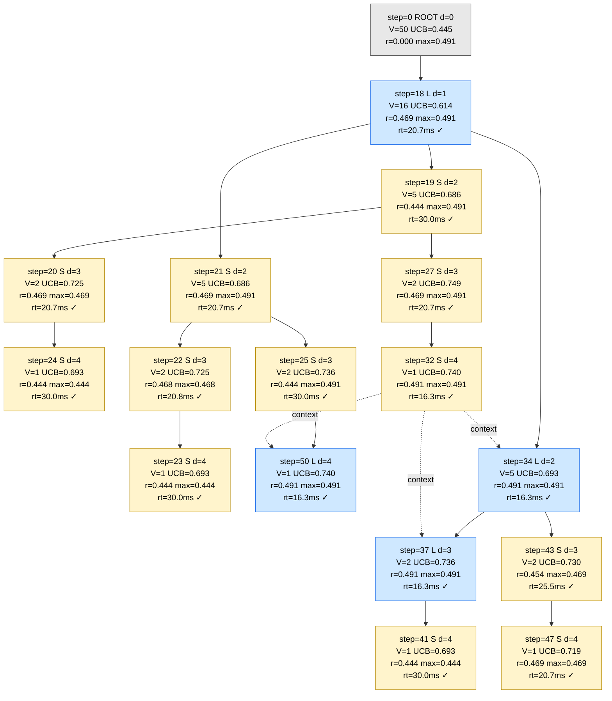
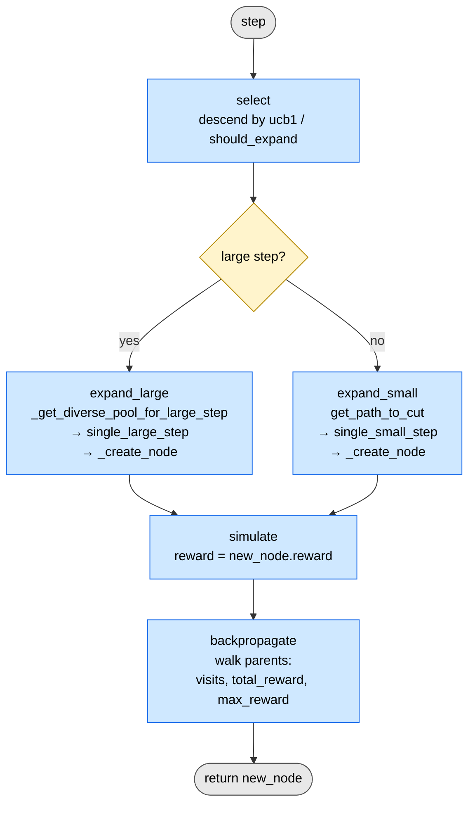

# MCTS Debug Output — KB-l2 Problem 4 (50 steps)

Run: `outputs/KB-l2_AdaExplore_50/2_4/`
Model: `claude-opus-4-7` · `total_steps=50` · `exploration_weight=0.3` · `reward_alpha=0.0` (UCB uses avg_reward only) · `p_large=0.2`

Tree summary (`tree_stats.json`): 51 nodes, max depth 4, avg depth 2.84, total visits 195, large-step nodes 18, small-step nodes 32.
Global best: **node 9**, runtime 16.2ms (baseline 13.80ms, fast_p=0.852, score `[1, 1, 0.4912]`).

Hardware note: this run executed on `NVIDIA GeForce RTX 4090` (per `global_best_metrics_50.json`), not the A6000 @ 1500MHz fp32 used for Table 1 in the paper — fast_p values here are not directly comparable to the paper.

## Visual conventions

- **Fill**: blue = large_step, yellow = small_step, grey = dummy_root
- **Border**: thick gold = on the best-so-far trail; gold-ringed thicker = global best (step 9); red dashed = correctness=False
- **Edges**: solid `→` = tree parent; dashed `⇢` = `context_node_ids` (large-step regen used these as seed); thick gold `==>` (best-so-far diagram only) = best-so-far progression, NOT a structural relation
- **Label** (4 lines): `step=N L|S|R d=D` · `V=v UCB=u` · `r=node max=subtree` · `rt=Xms ✓|FAIL`
- All `V` and `UCB` are end-of-run values (from `tree_structure.txt`); `r` (node_reward) is fixed at this kernel's own score.
- `rt_score` (used only in the best-so-far diagram) = `baseline_time / runtime` (≈ fast_p / speedup ratio). This is NOT the same as `r` (node_reward) shown elsewhere.

## Best-so-far evolution

Note: edges below are **best-so-far progression** (each node was a new best at that step), NOT tree-parent or context relations. See branch diagrams below for actual structure.

## Branch 1 (root child node 1, 10 nodes)

## Branch 3 (root child node 3, 9 nodes)

## Branch 8 (root child node 8, 15 nodes — contains global best)

## Branch 18 (root child node 18, 16 nodes)

## Observations

1. **Reward plateau ≈ 0.469.** Almost every successful kernel sits at `r ≈ 0.469` — that's the score for a correct kernel running at ~20.6ms (the baseline-ish plateau the model first reaches). The score formula barely separates correct kernels by speedup until the runtime drops below ~17ms (`r ≈ 0.49`).
2. **The breakthrough happens early and is reproduced.** The global best (node 9) is a small_step refinement of the very first large_step in branch 8 (node 8) — and it lands at step 9. After that, MCTS *re-discovers* the same 16.2–16.3ms class many times: nodes 12, 13, 16, 26, 32, 34, 35, 37, 46, 50 all sit at 16.2–16.3ms with `r ≈ 0.49`. There's no further speedup beyond ~16.2ms — the search saturates.
3. **Node 9 is the seed for an entire fan-out.** Every large_step in branch 8 (12, 13, 16, 26, 35) carries `context=[9]` (or `[9, 26]` for 35). That means once node 9 found the 16.2ms regime, AdaExplore kept regenerating fresh large_steps using it as the seed — most of them landed back at the same 16.2–16.3ms cluster.
4. **Cross-branch context: node 32 leaks into branch 18.** Node 32 is a depth-4 small_step under branch 18 (parent 27) at 16.3ms. After it fires, **three** subsequent large_steps use it as seed: nodes 34, 37 (both inside branch 18) and node 50 (whose tree parent is node 25 in branch 18). This is the same "context-seed > tree-parent" pattern seen in 2_2: the load-bearing edge is `32 ⇢ 34 / 37 / 50`, not the tree parents.
5. **Failures barely hurt.** Nodes 2, 4, 38 each pull avg_reward to 0.05, but with visits=1 their UCB is too low to ever be picked again — MCTS naturally prunes them. Note nodes 2 and 4 each spawned **one** successor (5, 29) before being abandoned.
6. **Branch 1 found 16.2ms too — late and via a small_step.** Node 46 (step 46) at 16.2ms is a small_step refinement of node 1 with `context=[1]` only. Branch 1 had been stuck at 20.6–20.7ms for 45 steps, then a single small_step jumped the same gap branch 8 jumped at step 9. UCB on node 46 is 0.812 — second highest in the tree — so this is a productive late discovery.
7. **UCB caveat.** The values shown are end-of-run. The actual selection at each step used the UCB at that moment, which would have been different. Recovering historical UCBs would require replaying backprop from the per-step logs.

## Full tree (all branches)

All 51 nodes in one view: solid `→` = tree parent, dashed `⇢` = `context_node_ids` (large-step seeds and small-step path memory), gold border = best-so-far trail (1 → 9), thick gold = global best (9), red dashed = correctness=False (2, 4, 38).

```mermaid
flowchart TD
  N0["step=0 ROOT d=0<br/>V=50 UCB=0.445<br/>r=0.000 max=0.491"]:::root

  N1["step=1 L d=1<br/>V=10 UCB=0.616<br/>r=0.469 max=0.491<br/>rt=20.6ms ✓"]:::large
  N2["step=2 S d=2<br/>V=2 UCB=0.581<br/>r=0.050 max=0.469<br/>FAIL"]:::small
  N5["step=5 S d=3<br/>V=1 UCB=0.719<br/>r=0.469 max=0.469<br/>rt=20.7ms ✓"]:::small
  N6["step=6 L d=2<br/>V=5 UCB=0.667<br/>r=0.469 max=0.469<br/>rt=20.7ms ✓"]:::large
  N7["step=7 S d=3<br/>V=2 UCB=0.738<br/>r=0.469 max=0.469<br/>rt=20.6ms ✓"]:::small
  N36["step=36 L d=4<br/>V=1 UCB=0.719<br/>r=0.469 max=0.469<br/>rt=20.7ms ✓"]:::large
  N40["step=40 S d=3<br/>V=2 UCB=0.725<br/>r=0.443 max=0.468<br/>rt=30.3ms ✓"]:::small
  N44["step=44 L d=4<br/>V=1 UCB=0.718<br/>r=0.468 max=0.468<br/>rt=20.8ms ✓"]:::large
  N46["step=46 S d=2<br/>V=2 UCB=0.812<br/>r=0.491 max=0.491<br/>rt=16.2ms ✓"]:::small
  N48["step=48 S d=3<br/>V=1 UCB=0.738<br/>r=0.488 max=0.488<br/>rt=16.7ms ✓"]:::small

  N3["step=3 L d=1<br/>V=9 UCB=0.613<br/>r=0.469 max=0.469<br/>rt=20.6ms ✓"]:::large
  N4["step=4 S d=2<br/>V=2 UCB=0.574<br/>r=0.050 max=0.469<br/>FAIL"]:::small
  N29["step=29 L d=3<br/>V=1 UCB=0.719<br/>r=0.469 max=0.469<br/>rt=20.7ms ✓"]:::large
  N30["step=30 S d=2<br/>V=5 UCB=0.655<br/>r=0.469 max=0.469<br/>rt=20.7ms ✓"]:::small
  N33["step=33 S d=3<br/>V=2 UCB=0.720<br/>r=0.432 max=0.469<br/>rt=37.6ms ✓"]:::small
  N39["step=39 S d=4<br/>V=1 UCB=0.719<br/>r=0.469 max=0.469<br/>rt=20.7ms ✓"]:::small
  N42["step=42 S d=3<br/>V=2 UCB=0.725<br/>r=0.443 max=0.469<br/>rt=30.6ms ✓"]:::small
  N45["step=45 L d=4<br/>V=1 UCB=0.719<br/>r=0.469 max=0.469<br/>rt=20.7ms ✓"]:::large
  N49["step=49 L d=2<br/>V=1 UCB=0.913<br/>r=0.469 max=0.469<br/>rt=20.7ms ✓"]:::large

  N8["step=8 L d=1<br/>V=15 UCB=0.607<br/>r=0.469 max=0.491<br/>rt=20.6ms ✓"]:::large
  N9["step=9 S d=2<br/>V=5 UCB=0.706<br/>r=0.491 max=0.491<br/>rt=16.2ms ✓"]:::small
  N10["step=10 S d=3<br/>V=2 UCB=0.759<br/>r=0.489 max=0.491<br/>rt=16.6ms ✓"]:::small
  N13["step=13 L d=4<br/>V=1 UCB=0.740<br/>r=0.491 max=0.491<br/>rt=16.3ms ✓"]:::large
  N15["step=15 S d=3<br/>V=2 UCB=0.748<br/>r=0.469 max=0.489<br/>rt=20.6ms ✓"]:::small
  N17["step=17 S d=4<br/>V=1 UCB=0.738<br/>r=0.489 max=0.489<br/>rt=16.6ms ✓"]:::small
  N11["step=11 S d=2<br/>V=5 UCB=0.619<br/>r=0.469 max=0.491<br/>rt=20.6ms ✓"]:::small
  N12["step=12 L d=3<br/>V=2 UCB=0.759<br/>r=0.491 max=0.491<br/>rt=16.2ms ✓"]:::large
  N14["step=14 S d=4<br/>V=1 UCB=0.738<br/>r=0.488 max=0.488<br/>rt=16.7ms ✓"]:::small
  N16["step=16 L d=3<br/>V=2 UCB=0.539<br/>r=0.491 max=0.491<br/>rt=16.3ms ✓"]:::large
  N38["step=38 S d=4<br/>V=1 UCB=0.300<br/>r=0.050 max=0.050<br/>FAIL"]:::small
  N26["step=26 L d=2<br/>V=4 UCB=0.726<br/>r=0.491 max=0.491<br/>rt=16.3ms ✓"]:::large
  N28["step=28 S d=3<br/>V=2 UCB=0.718<br/>r=0.468 max=0.468<br/>rt=20.8ms ✓"]:::small
  N31["step=31 S d=4<br/>V=1 UCB=0.718<br/>r=0.468 max=0.468<br/>rt=20.8ms ✓"]:::small
  N35["step=35 L d=3<br/>V=1 UCB=0.844<br/>r=0.491 max=0.491<br/>rt=16.3ms ✓"]:::large

  N18["step=18 L d=1<br/>V=16 UCB=0.614<br/>r=0.469 max=0.491<br/>rt=20.7ms ✓"]:::large
  N19["step=19 S d=2<br/>V=5 UCB=0.686<br/>r=0.444 max=0.491<br/>rt=30.0ms ✓"]:::small
  N20["step=20 S d=3<br/>V=2 UCB=0.725<br/>r=0.469 max=0.469<br/>rt=20.7ms ✓"]:::small
  N24["step=24 S d=4<br/>V=1 UCB=0.693<br/>r=0.444 max=0.444<br/>rt=30.0ms ✓"]:::small
  N27["step=27 S d=3<br/>V=2 UCB=0.749<br/>r=0.469 max=0.491<br/>rt=20.7ms ✓"]:::small
  N32["step=32 S d=4<br/>V=1 UCB=0.740<br/>r=0.491 max=0.491<br/>rt=16.3ms ✓"]:::small
  N21["step=21 S d=2<br/>V=5 UCB=0.686<br/>r=0.469 max=0.491<br/>rt=20.7ms ✓"]:::small
  N22["step=22 S d=3<br/>V=2 UCB=0.725<br/>r=0.468 max=0.468<br/>rt=20.8ms ✓"]:::small
  N23["step=23 S d=4<br/>V=1 UCB=0.693<br/>r=0.444 max=0.444<br/>rt=30.0ms ✓"]:::small
  N25["step=25 S d=3<br/>V=2 UCB=0.736<br/>r=0.444 max=0.491<br/>rt=30.0ms ✓"]:::small
  N50["step=50 L d=4<br/>V=1 UCB=0.740<br/>r=0.491 max=0.491<br/>rt=16.3ms ✓"]:::large
  N34["step=34 L d=2<br/>V=5 UCB=0.693<br/>r=0.491 max=0.491<br/>rt=16.3ms ✓"]:::large
  N37["step=37 L d=3<br/>V=2 UCB=0.736<br/>r=0.491 max=0.491<br/>rt=16.3ms ✓"]:::large
  N41["step=41 S d=4<br/>V=1 UCB=0.693<br/>r=0.444 max=0.444<br/>rt=30.0ms ✓"]:::small
  N43["step=43 S d=3<br/>V=2 UCB=0.730<br/>r=0.454 max=0.469<br/>rt=25.5ms ✓"]:::small
  N47["step=47 S d=4<br/>V=1 UCB=0.719<br/>r=0.469 max=0.469<br/>rt=20.7ms ✓"]:::small

  N0 --> N1
  N1 --> N2
  N2 --> N5
  N1 --> N6
  N6 --> N7
  N7 --> N36
  N6 --> N40
  N40 --> N44
  N1 --> N46
  N46 --> N48

  N0 --> N3
  N3 --> N4
  N4 --> N29
  N3 --> N30
  N30 --> N33
  N33 --> N39
  N30 --> N42
  N42 --> N45
  N3 --> N49

  N0 --> N8
  N8 --> N9
  N9 --> N10
  N10 --> N13
  N9 --> N15
  N15 --> N17
  N8 --> N11
  N11 --> N12
  N12 --> N14
  N11 --> N16
  N16 --> N38
  N8 --> N26
  N26 --> N28
  N28 --> N31
  N26 --> N35

  N0 --> N18
  N18 --> N19
  N19 --> N20
  N20 --> N24
  N19 --> N27
  N27 --> N32
  N18 --> N21
  N21 --> N22
  N22 --> N23
  N21 --> N25
  N25 --> N50
  N18 --> N34
  N34 --> N37
  N37 --> N41
  N34 --> N43
  N43 --> N47

  N1 -. context .-> N6
  N1 -. context .-> N36
  N7 -. context .-> N36
  N1 -. context .-> N44
  N7 -. context .-> N44
  N1 -. context .-> N46
  N3 -. context .-> N29
  N3 -. context .-> N45
  N3 -. context .-> N49
  N9 -. context .-> N13
  N9 -. context .-> N12
  N9 -. context .-> N16
  N9 -. context .-> N26
  N9 -. context .-> N35
  N32 -. context .-> N50
  N32 -. context .-> N34
  N32 -. context .-> N37

  class N1,N8 trail
  class N9 best
  class N2,N4,N38 fail

  classDef root  fill:#e8e8e8,stroke:#555,color:#000
  classDef large fill:#cfe8ff,stroke:#1f6feb,color:#000
  classDef small fill:#fff4cc,stroke:#b58900,color:#000
  classDef trail stroke:#d4a017,stroke-width:3px
  classDef best  fill:#fff4cc,stroke:#d4a017,stroke-width:5px,color:#000
  classDef fail  stroke:#d33,stroke-dasharray:4 3,stroke-width:2px
```

## `MCTSKernelOptimizer.step()` — Execution Flow

`step(step_idx)` runs one MCTS iteration in `agent/mcts.py:601`. It follows the textbook four phases (Select → Expand → Simulate → Backpropagate), with project-specific logic in how the expansion type (large vs small step) is chosen and how failed proposals fall back.

### Phases

1. **Selection** (`mcts.py:610`, body at `mcts.py:285`)
   - Start at `self.root` and descend by repeatedly picking `argmax(child.ucb1)`.
   - At each internal node, check `should_expand(...)`: if the "open a new child" UCB exceeds the best existing child's UCB, stop descent and return that node as the expansion point.
   - Otherwise continue until a leaf is reached.

2. **Decide expansion type** (`mcts.py:616`)
   - If the selected node is `dummy_root` → always `large_step`.
   - Else: count children with `created_by == "small_step"`. Force `large_step` when that count `>= small_step_limit`; otherwise pick large with probability `p_large` (default `0.25`), else small.

3. **Expansion** (`mcts.py:627`)
   - `expand_large(selected_node)` — builds a *diverse pool* of best-of-component kernels along the path-to-root (plus optional softmax/geometric-sampled extras from off-path components), calls `single_large_step` to propose a new kernel, attaches it as a child labelled `large_step`.
   - `expand_small(selected_node)` — walks `get_path_to_cut()` (up to the nearest `large_step` ancestor), feeds the last `max_memory_round` kernels as context to `single_small_step`, attaches the refined kernel as a child labelled `small_step`.
   - Each new node is built via `_create_node`, which updates `global_best_node` if its `score` tuple is higher (`mcts.py:279`).

4. **Fallback on failure** (`mcts.py:632`)
   - If the chosen expansion returned `None`, retry with the other expansion type.
   - If that also returns `None`, log a warning and return `selected_node` (no new node added, no simulate/backprop).

5. **Simulation** (`mcts.py:644`, body at `mcts.py:532`)
   - `simulate(new_node, num_rollouts=1)` just returns `new_node.reward` — the reward derived from `(compiled, correct, speedup)` via the `REWARD_*` / `SPEEDUP_*` constants. No real rollouts are performed (multi-rollout path raises `NotImplementedError`).

6. **Backpropagation** (`mcts.py:647`, body at `mcts.py:546`)
   - Walk from `new_node` upward to the root: for each ancestor increment `visits`, add `reward` to `total_reward`, and update `max_reward` if beaten.

7. **Return** `new_node` (or `selected_node` on total expansion failure).

### Mermaid call-flow

