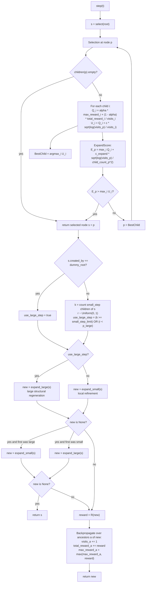

```mermaid
flowchart TD
    A["step(t)"] --> B["s = select(root)"]

    B --> C["Selection at node p"]

    C --> D{"children(p) empty?"}
    D -- "yes" --> S["return selected node s = p"]
    D -- "no" --> E["For each child i:<br/>Q_i = alpha * max_reward_i + (1 - alpha) * total_reward_i / visits_i<br/>U_i = Q_i + c * sqrt(log(visits_p) / visits_i)"]

    E --> F["BestChild = argmax_i U_i"]

    E --> G["ExpandScore:<br/>E_p = max_i Q_i + c_expand * sqrt(log(visits_p) / child_count_p^2)"]
    G --> H{"E_p > max_i U_i?"}

    H -- "yes" --> S
    H -- "no" --> I["p = BestChild"]
    I --> C

    S --> J{"s.created_by == dummy_root?"}
    J -- "yes" --> K["use_large_step = true"]
    J -- "no" --> L["k = count small_step children of s<br/>r ~ Uniform(0, 1)<br/>use_large_step = (k >= small_step_limit) OR (r < p_large)"]

    K --> M{"use_large_step?"}
    L --> M

    M -- "yes" --> N["new = expand_large(s)<br/>large structural regeneration"]
    M -- "no" --> O["new = expand_small(s)<br/>local refinement"]

    N --> P{"new is None?"}
    O --> P

    P -- "yes and first was large" --> Q["new = expand_small(s)"]
    P -- "yes and first was small" --> R["new = expand_large(s)"]
    P -- "no" --> T["reward = R(new)"]

    Q --> U{"new is None?"}
    R --> U

    U -- "yes" --> V["return s"]
    U -- "no" --> T

    T --> W["Backpropagate over ancestors a of new:<br/>visits_a += 1<br/>total_reward_a += reward<br/>max_reward_a = max(max_reward_a, reward)"]

    W --> X["return new"]

```