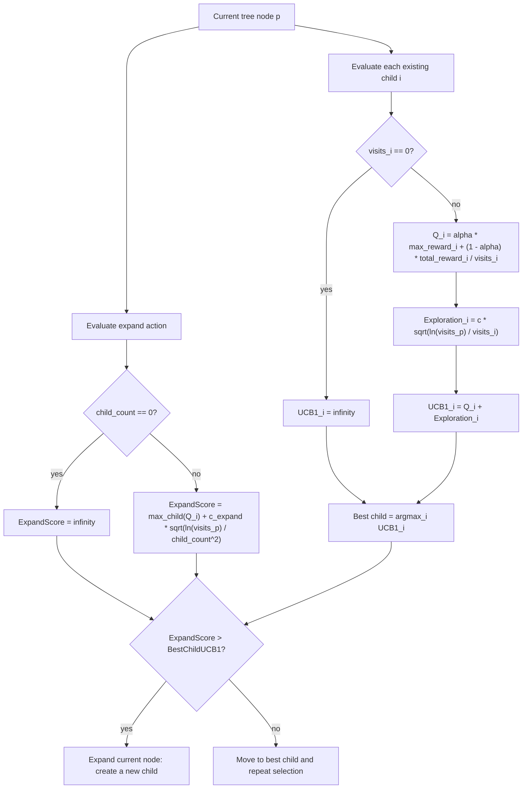

```mermaid
flowchart TD
    A["Current tree node p"] --> B["Evaluate each existing child i"]

    B --> C{"visits_i == 0?"}
    C -- "yes" --> D["UCB1_i = infinity"]
    C -- "no" --> E["Q_i = alpha * max_reward_i + (1 - alpha) * total_reward_i / visits_i"]

    E --> F["Exploration_i = c * sqrt(ln(visits_p) / visits_i)"]
    F --> G["UCB1_i = Q_i + Exploration_i"]

    D --> H["Best child = argmax_i UCB1_i"]
    G --> H

    A --> I["Evaluate expand action"]
    I --> J{"child_count == 0?"}
    J -- "yes" --> K["ExpandScore = infinity"]
    J -- "no" --> L["ExpandScore = max_child(Q_i) + c_expand * sqrt(ln(visits_p) / child_count^2)"]

    K --> M{"ExpandScore > BestChildUCB1?"}
    L --> M
    H --> M

    M -- "yes" --> N["Expand current node: create a new child"]
    M -- "no" --> O["Move to best child and repeat selection"]
```